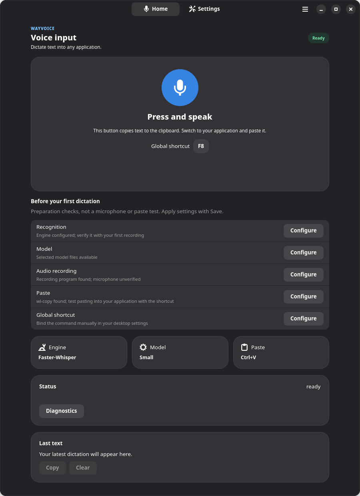
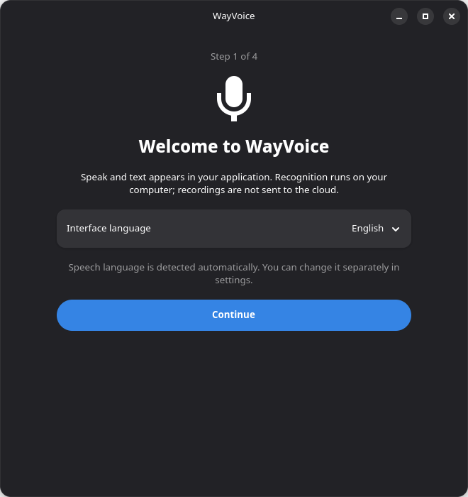
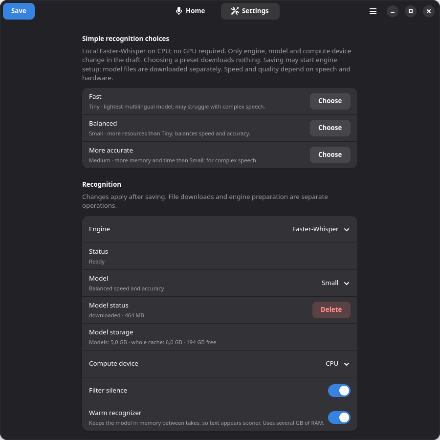

<p align="center">
  
</p>

# WayVoice

Local voice typing for Linux. Press a shortcut to start recording, speak, then press it again to stop. WayVoice transcribes your speech and pastes the text into the active application where automatic paste is available. Otherwise, it leaves the text in your clipboard.

WayVoice uses GTK 4 and libadwaita, records through PipeWire, and supports Faster-Whisper and whisper.cpp for local recognition.

[Download](https://github.com/pavlenkosa/wayvoice/releases) · [Report a bug](https://github.com/pavlenkosa/wayvoice/issues) · [Changelog](CHANGELOG.md)

**Status:** alpha. GNOME Wayland is the primary tested desktop. KDE Plasma integration is implemented, but complete installed dictation and paste checks are still pending. wlroots desktops and installed Flatpak builds also need testing.

This README describes version **0.6.9**. Older packages may not include the in-app updater or ten-language interface; check their release notes.

## Screenshots

Screenshots show the development version in English.



<details>
<summary>First-run setup and model settings</summary>





</details>

## Features

- Local recognition with Faster-Whisper or whisper.cpp; custom recognition commands are also supported.
- Model downloads with progress, cancellation, storage information and deletion.
- An optional warm Faster-Whisper worker to avoid reloading the model between recordings.
- Automatic speech-language detection or a fixed recognition language.
- Spoken punctuation commands in English and Russian.
- Wayland clipboard delivery and optional automatic paste through `ydotool`.
- A compact, draggable status indicator without transcript text.
- First-run setup, prompts for unsaved settings, and diagnostics you can review before sharing.
- Ten interface languages: English, Russian, Spanish, Portuguese, French, German, Simplified Chinese, Japanese, Arabic and Hindi. Arabic uses a right-to-left layout.

The interface language and recognition language are separate settings. Translations are included with the app and work offline.

## Installation

Download the package for your system from [GitHub Releases](https://github.com/pavlenkosa/wayvoice/releases). Release assets include SHA-256 checksums.

### Debian / Ubuntu

Install the downloaded DEB with APT so its dependencies are installed too:

```bash
sudo apt install ./wayvoice_*_amd64.deb
```

Run the command in the directory containing the downloaded package. Use the package matching your architecture, if one is provided. The application requires Python 3.11 or newer, GTK 4, libadwaita, PipeWire recording tools and `wl-clipboard`.

### Fedora

RPM builds currently target Fedora 44:

```bash
sudo dnf install ./wayvoice-*-1.fc44.x86_64.rpm
```

Installation, upgrade and removal have been checked in a disposable Fedora 44 container. A live Fedora desktop, microphone permissions and automatic paste still need verification. Other RPM distributions are not validated.

### Flatpak

The [Flatpak manifest](io.github.stepan.WayVoice.json) is experimental. WayVoice is not currently published on Flathub.

Flatpak builds use direct background processes instead of systemd user services. Configure the shortcut in your desktop and paste manually from the clipboard; native shortcut registration and the bundled paste helper are not supported in the sandbox.

## First launch

Open **WayVoice** from the application menu, or run:

```bash
wayvoice-settings
```

1. Choose the interface language.
2. Choose a model: **Fast**, **Balanced** or **More accurate**. Larger models need more memory and take longer to process speech.
3. Select **Download and prepare** to download the required components and model, or **Set up later** to postpone it.
4. Configure the shortcut and check the preparation guidance on Home.

Existing configurations open directly. Selecting a preset only changes the settings draft. Click **Save** to apply it; model downloads are separate actions. Pressing the dictation shortcut never downloads missing model weights.

## Usage

1. Place the cursor where you want the text.
2. Press the shortcut to start recording.
3. Speak, then press the shortcut again to stop.
4. Wait for recognition. If the text is not pasted automatically, paste it from the clipboard.

The Home recording button copies the result to the clipboard so you can switch to the destination application and paste it yourself.

Choose **Open indicator** from the menu, or run:

```bash
wayvoice-settings --indicator
```

Drag the indicator by its status row. Its window menu exposes desktop actions; in KDE, use **Keep Above** to keep it over other windows. Closing Settings or the indicator does not stop the background daemon.

### Shortcuts and paste on Wayland

| Desktop | Shortcut setup |
| --- | --- |
| GNOME | Configure the shortcut in WayVoice Settings. |
| KDE Plasma | Click **Configure in KDE** to assign the action through the GlobalShortcuts portal. If unavailable, bind `wayvoice toggle` in Plasma's shortcut settings. |
| Other Wayland desktops | Bind the command shown in WayVoice Settings using the desktop or compositor's shortcut configuration. |

For Flatpak, use the command shown by the app rather than the native command above. Remove an old manual binding before assigning the same key through the KDE portal.

Automatic paste requires `ydotool` and access to `/dev/uinput`. Native packages include a fallback helper and prefer a system-installed copy when available. If the helper cannot be used, recognized text still reaches the clipboard. Choose **Ctrl+Shift+V** for terminals such as Konsole; ordinary editors generally use **Ctrl+V**.

### Recognition engines

**Faster-Whisper** is the default. Choose a built-in model, a compatible Hugging Face repository, or a local CTranslate2 model directory. Keeping the model warm speeds up repeated dictation at the cost of idle memory use.

**whisper.cpp** uses your local `whisper-cli` binary and a compatible model file.

**External command** passes the recording to another program and reads its standard output as text. For example:

```text
vosk-transcriber -i {audio}
```

The template is executed through `/bin/sh`; `{audio}` is replaced with the recording path. Only use commands you trust.

## Command line

```bash
wayvoice toggle          # Start or stop recording
wayvoice start           # Start recording
wayvoice stop            # Stop and transcribe
wayvoice cancel          # Cancel the current dictation
wayvoice status          # Show daemon status
wayvoice engine-status   # Check the recognition runtime
wayvoice settings        # Open Settings
```

Model commands operate on the model saved in Settings:

```bash
wayvoice model             # Show model status
wayvoice model --download  # Prepare the saved model
wayvoice model --cancel    # Cancel its download
```

## Updating

Install a newer DEB or RPM using the same package-manager command as above. Native package upgrades restart the background services.

On builds that include the updater, choose **Check for updates…** from the menu, or run:

```bash
wayvoice update --check
wayvoice update --install
```

The updater downloads a matching DEB or RPM from the latest stable GitHub release, checks its SHA-256 and package metadata, and opens the system package manager with administrator authorization. If that release has no package for your architecture, it reports an error. Finish dictation and model preparation first. New recordings are blocked during installation; the services restart and the daemon's version is checked afterwards. Reopen Settings to load the new interface.

The updater requires a compatible running daemon. Older installations need a manual package upgrade first. It does not update source checkouts or Flatpak installations, and it does not automatically roll back failed package transactions. Release checksums verify integrity against the published release; they are not independent package signatures.

## Privacy

Faster-Whisper and whisper.cpp process recordings locally. Network access is used for downloads you request, plus explicit update checks and package downloads from GitHub. A custom recognition command may have its own network behavior.

Temporary recordings are removed after processing or cancellation. Dictation text is hidden in desktop notifications by default. Clipboard managers and other applications may retain clipboard text according to your desktop settings.

## Troubleshooting

**Nothing happens when I press the shortcut.** Check the shortcut configuration and preparation rows on Home. On desktops that require a manual binding, use the command shown in Settings.

**Recognition works, but text is not inserted.** Try pasting manually. If the text is in the clipboard, check the paste mode and `ydotool` permissions. Terminals often require **Ctrl+Shift+V**.

**The model is missing.** Download it in Settings, or run `wayvoice model --download` after saving the selected model.

**The first transcription is slow.** A downloaded model still needs to load into memory. The warm recognizer avoids repeating that work, but uses more RAM.

For other problems, open **Diagnostics** from the menu and review the report before sharing it. On systemd installations, inspect the service log with:

```bash
journalctl --user -u wayvoice.service -f
```

## Development and contributions

Bug reports, fixes, translations and desktop testing are welcome. For a bug report, include the version, package type, desktop, session type and recognition engine. For paste problems, say whether the text reached the clipboard. Remove private dictation text from logs and reports.

Clone the repository and run the checks with Python 3.11 or newer:

```bash
git clone https://github.com/pavlenkosa/wayvoice.git
cd wayvoice
make lint
make test
```

GTK tests require GTK 4/libadwaita bindings and a display. Tests that cannot run without those dependencies are skipped; unit tests do not verify microphone capture or insertion into real applications.

Build native packages with:

```bash
make deb  # Debian packaging tools and a C compiler required
make rpm  # Fedora with rpm-build and systemd-rpm-macros
```

Or build the RPM in a Fedora container with `./scripts/build-rpm-container.sh`. Build output goes to `dist/`; the scripts do not install packages or start host services.

Keep pull requests focused. Add user-facing strings to all interface catalogues and preserve their format parameters. For larger changes, open an issue first. See [CONTRIBUTING.md](CONTRIBUTING.md) and [SECURITY.md](SECURITY.md).

## License

[GNU Affero General Public License v3.0 or later](LICENSE). Bundled `ydotool` licensing and attribution are listed in [third_party/ydotool](third_party/ydotool/README.wayvoice.md).
